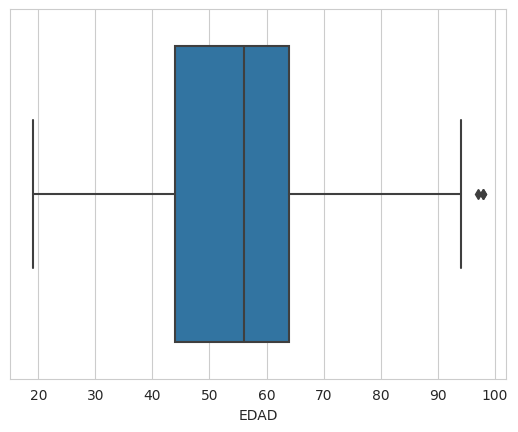
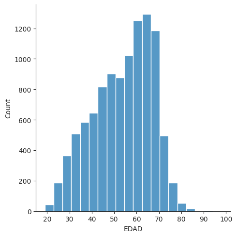
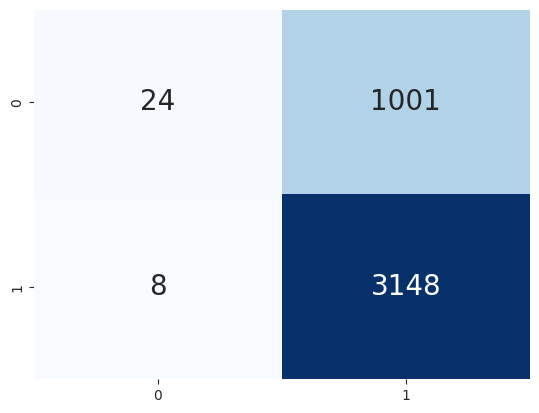
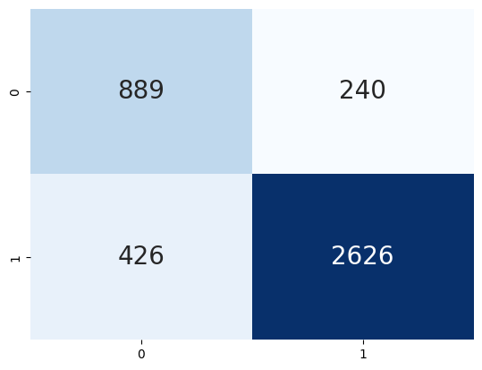
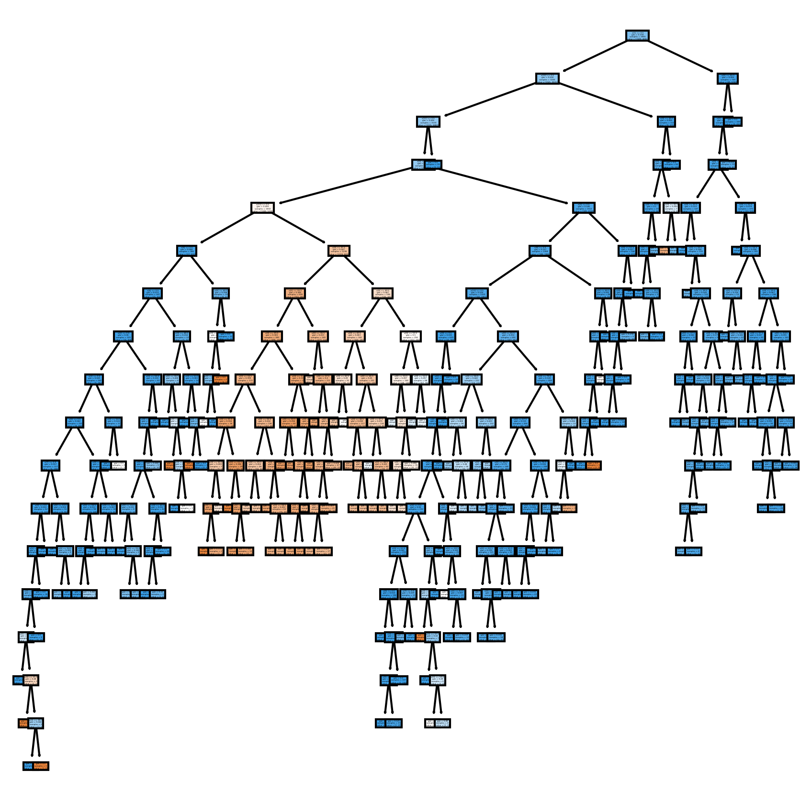
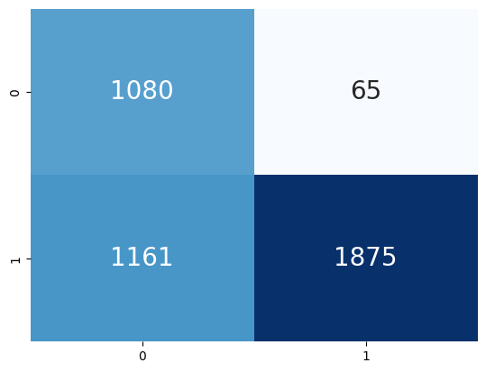
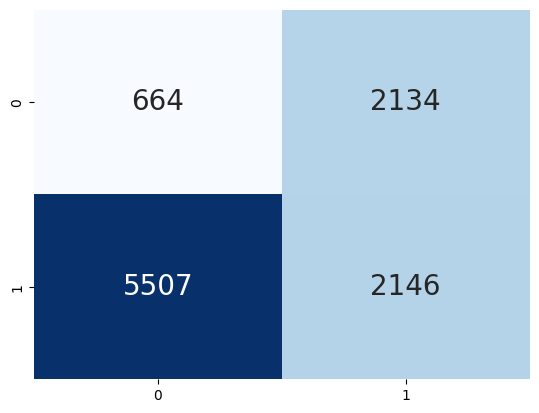

# Proyecto para Ciencia de Datos (Demo Day)
## :rocket: Proyecto: Causas de Siniestralidad en Seguros de Vida (ultimos 4 años)
**Data Science - BEDU**   
*Javier E. Asmat Venegas*   


###### [Imagen de rawpixel.com en Freepik](https://www.freepik.es/vector-gratis/ilustracion-seguro-vida_2605710.htm#page=2&query=seguro%20vida&position=25&from_view=keyword&track=ais)
---

### :capital_abcd: Introducción
El proyecto se basa en datos reales obtenidos de los ultimos 4 años de una compañia de seguros. Los datos corresponden a los siniestros ocurridos en dicho periodo de tiempo obteniendose entre otros
datos las causas de dicho siniestro. Se evaluo solo casos de personas fallecidas. Dentro de la información que se evalua además de las causas del fallecimiento se considera el sexo y la edad de la
persona fallecida.

### :dart: Objetivos y Tareas

- Obtener los datos de un modelo de base de datos relacional y extraer los datos a un formato CSV.

- Realizar análisis exploratorio de los datos con el fin de obtener estadísticas sobre los datos obtenidos.

- Utilizar __Python__ sobre la IDE __Jupyter Notebooks__ para realizar labores de predicción, clasificación, entre otras posibles.

- Realizar labores de limpieza de los datos con el fin de tener un conjunto de datos limpio y bien estructurado que permita realizar las tareas de predicción y/o clasificación.

- Con base en el campo que nos permite determinar si el paciente tuvo COVID o no, evaluaremos diferentes modelos de regresión y clasificación con el fin de encontrar el mejor posible para 
predecir este dato en otros asegurados.

---

### :ballot_box_with_check: Obtención y extracción de los datos

Los datos se obtuvieron de una Base de Datos __ORACLE__ pues en ella se encuentran los datos sobre los que realizaremos
el análisis exploratorio más detallado. Se contó inicialmente con los siguientes conjuntos de datos:

- [datos_polizas.csv](datasets/datos_polizas.csv)
- [datos_polizas_2.csv](datasets/datos_polizas_2.csv)
- [datos_polizas_3.csv](datasets/datos_polizas_3.csv)
- [datos_siniestros.csv](datasets/datos_siniestros.csv)
- [datos_siniestros_2.csv](datasets/datos_siniestros_2.csv)

Previo a la carga de datos, se reviso la información a recuperar por ello se extrajo tanto de las pólizas en vigor o vigentes como de los siniestros ocurridos en los ultimos 4 años.
Se analizo la información obtenida y derivado de esto se determino que los datos mas acordes **para los fines de este proyecto únicamente son los referentes a los siniestros**.

El proceso de obtención de los datos así como el de extracción de la información se puede consultar en los siguientes scripts:

- [Polizas](scripts/datos_polizas.sql) 
- [Siniestros](scripts/datos_siniestros.sql)

---

### :ballot_box_with_check: Análisis Exploratorio de Datos

<details><summary><strong>Análisis de tendencia central y visual por medio de Pandas (<em><a href="notebooks/eda.ipynb">notebook</a>)</em></strong> </summary>
	<p>

**Variables numéricas (edad)**

- Medidas de tendencia central y variabilidad

	```
    count    10451.000000
    mean        53.721749
    std         13.321296
    min         19.000000
    25%         44.000000
    50%         56.000000
    75%         64.000000
    max         98.000000
   ```

   - La edad promedio es 53.72
   - La edad mínima es 19
   - La edad máxima es 98
   - El 25% de los datos tienen un valor menor a 44
   - El 50% de los datos tienen un valor menor a 56 (mediana)
   - El 75% de los datos tienen un valor menor a 64
   - Rango intercuartilico: 20
   - La desviación estándar es 13.32 (hip: están ligeramente dispersos)

- Diagrama de caja e Histograma

	El siguiente diagrama confirma los resultados anteriores. Los bigotes nos indican que los valores de 19 y 98 son *raros* por lo que se consideran atípicos.

	

	Podemos comprobar esto con un histograma. Los valores más elevados corresponden con el promedio y los más pequeños con los valores atípicos que muestra el diagrama de caja.

	

**Variables categóricas**

- Tabla de contingencia (causa COVID x Sexo x Edad)

   ```
   SEXO	    0	     1	    total
   COVID	0	1	 0	  1	
   EDAD					
   19	    1	0	 3	  0	    4
   20	    0	0	 3	  0	    3
   21	    1	0	 8	  0	    9
   22	    3	0	24	  0	   27
   23	    5	0	21	  0	   26
   ...	...	...	...	...	...
   93   	1	0	 1	  0	    2
   94	    0	0	 1	  0	    1
   97    	1	0	 0	  0	    1
   98	    2	0	 0	  0	    2
   total 2180 417 6318 1536	10451
   ```

   Algunas interpretaciones:

   - 417 mujeres fallecieron a causa del COVID.
   - 1536 hombres fallecieron a causa del COVID.
   - 8498 personas (hombres y mujeres) fallecieron por otras causas o tuvieron algún siniestro que no causo fallecimiento.

- Tabla de contingencia (fallecidos por sospecha de covid)

   ```
   COVID	        0 	       1	total
   SOSPECHA COVID	0	  1	   0	
   SEXO				
     0	         2060	120	 417	2597
     1	         5863	455	1536	7854
   total	     7923	575	1953	10451
   ```

   Algunas interpretaciones:

   - 575 personas (entre hombres y mujeres) fallecieron por sospecha de COVID.
   - 1953 personas (entre hombres y mujeres) fallecieron a causa de COVID. Los valores coinciden con los mostrados en la tabla anterior.

- Tabla de contingencia (fallecidos y vivos por sexo)

   ```
   FALLECIDO	N	   S	total
   SEXO			
           0  808	1789	 2597
           1 1990	5864	 7854
   total  	 2798	7653	10451
   ```

   Algunas interpretaciones:

   - 2597 mujeres sufrieron algún siniestro de las cuales 808 permanecen vivos y 1789 fallecieron.
   - 7854 hombres sufrieron algún siniestro de los cuales 1990 permanecen vivos y 5864 fallecieron.

</p>
</details>

Luego de los datos revisados se puede deducir que el conjunto de datos nos permite determinar que asegurados fallecieron y cuales sobrevivieron.

---

### :ballot_box_with_check: Clasificación

A continuación se muestran algunas técnicas de predicción basadas en clasificación.

Para realizar el entrenamiento con todos los modelos se siguieron los siguientes pasos:

1. Como datos de entrada se eligieron todos los campos menos la llave primaria, la región y por supuesto la columna que nos indica el estado del paciente.

1. Como dato de salida se eligió únicamente el estado del paciente.

1. Separar el conjunto de datos en entrenamiento y prueba (70%/30%).

1. Realizar el entrenamiento.

Para analizar los resultados se usó una matriz de confusión.


Una interpretación de los resultados de esta matriz, se puede dar mediante las siguientes fórmulas:

1. Precisión: De todas las clasificaciones positivas que hicimos, ¿cuántas de ésas eran en realidad positivas?
   
   *precision = VP / (VP + FP)*

1. Exactitud: Del total de clasificaciones que hicimos, ¿cuántas fueron clasificadas correctamente?
   
   *exactitud = (VP + VN) / (VP + FN + FP + VN)*

1. Sensibilidad: De todas las clasificaciones positivas que había en realidad, ¿cuántas fueron clasificadas correctamente como positivas?
   
   *sensibilidad = VP / (VP + FN)*

1. Especificidad: De todas las clasificaciones negativas que había en realidad, ¿cuántas fueron clasificadas correctamente como negativas?
   
   *especificidad = VN / (VN + FP)*


Adicionalmente se aplicó PCA para reducir el número de columnas. Con este paso se pretende comparar si todos los modelos definidos tienen alguna mejora. En este caso, ninguno de los modelos presentó una mejora considerable por lo que no se muestan en este documento, sin embargo pueden observarse en el *notebook* de cada modelo. Los resultados de PCA se guardaron en un archivo CSV ([_**notebook**_](notebooks/pca.ipynb)).

El número de componentes se elegió estableciente la varianza de las componentes. En este caso se usó una varianza del 95%. Como referencia se consultó [esta referencia](https://www.mikulskibartosz.name/pca-how-to-choose-the-number-of-components/).

<br/>

<u>**Regresión Lineal**</u>

Se inició este proyecto con la idea de encontrar alguna correlación entre las distintas variables. Sin embargo al sólo contar con una variable cuantitativa, de descartó el uso de una regresión lineal. Esto se puede corroborar con la siguiente gráfica de pares.

<details><summary><strong>Gráfica de pares (<em><a href="notebooks/regresion.ipynb">notebook</a>)</em></strong> </summary>
	<p>


</p>
</details>
<br/>

<u>**Clasificación Supervisada**</u>

Podemos usar los datos para *predecir* si un paciente puede o no sobrevivir usando un método de Clasificación Binaria Supervisada dado que sólo tenemos dos posibles valores. Se optó por emplear tres técnicas de clasificación.

<details><summary><strong>Regresión logística (<em><a href="notebooks/logistica.ipynb">notebook</a>)</em></strong> </summary>
	<p>

Podemos usar regresión logística en este caso la cuál modela el problema por medio del *sigmoidal* que permite dejar los valores en cero de un lado y los de uno en el otro:


Para el modelo generado se obtuvo la siguiente matriz:



Interpretación:

```
Precision: 0.941747572815534
Exactitud: 0.9428571428571428
Sensibilidad: 1.0
Especificidad: 0.25
```

Lo cual nos dice que la precisión, exactitud y sensibilidad es bastante buena. Sin embargo la especificad es muy baja lo cual indica que hubo muchos datos que fueron incorrectamente clasificados como negativos. Dicho de otra forma, el modelo fue bueno para clasificar fallecimientos pero no tanto para sobrevivientes. Esto se debe quizá a que tenemos más datos de fallecimientos.

</p>
</details>

<details><summary><strong>Árboles de Decisión (<em><a href="notebooks/random_forest.ipynb">notebook</a>)</em></strong> </summary>
<p>

La idea detrás de un árbol de decisión consiste en ir tomando decisiones de forma encadenada e ir descartando soluciones hasta quedarnos con una sola salida, en este caso el valor de la variable `status_patient`. De esta forma el método llamado *random forest*, consiste en tomar varios árboles (bosque) con las siguientes características:

1. Cada árbol de decisión debe ser independiente.
1. Cada árbol debe ser entrenado aleatoriamente,
1. La información que reciben los árboles debe ser distinta para que se basen en distintas características.

Una vez que todos los árboles se han entrenado, se hace un *consenso* para decidir el resultado de una predicción. Cada uno de los árboles *vota* y la clase más votada es la que define a qué clase pertenece el dato.

En este caso se hizo el mismo proceso que con la regresión logística: se separo el conjunto en entrenamiento y prueba, se entrenó y se midió el desempeño usando una matriz de confusión y las fórmulas para interpretar los resultados.



```
Precision: 0.9320388349514563
Exactitud: 0.9238095238095239
Sensibilidad: 0.9896907216494846
Especificidad: 0.125
```

Donde vemos que nuevamente la especificidad es bastante baja.

Cada uno de los árboles tiene una forma similar a la siguiente. Se muestra en el ejemplo el árbol 18 del bosque.



</p>
</details>

<details><summary><strong>Naïve Bayes (<em><a href="notebooks/naive_bayes.ipynb">notebook</a>)</em></strong> </summary>
<p>	

Este clasificador se basa en la noción de las características de un objeto que contribuyen a su categorización. Se muestran de la misma manera su matriz de confusión y métricas.



Interpretación:

```
Precision: 0.8333333333333334
Exactitud: 0.2571428571428571
Sensibilidad: 0.16666666666666666
Especificidad: 0.8
```

En este caso aunque mejoró considerablemente la especificidad, la exactitud y sensibilidad bajaron demasiado.

</p>
</details>
<br/>

<u>**Clasificación No Supervisada**</u>

Podemos usar la clasificación No Supervisada como una alternativa que permita clasificar los casos correctamente mediante clusterización, de forma tal que si el modelo genera correctamente las clases, podemos usar el modelo como predictor. En esta caso usamos los datos originales para comparar con la salida de nuestro modelo. Para este caso se obtó por usar *K-Means*.

<details><summary><strong>K-Means (<em><a href="notebooks/kmeans.ipynb">notebook</a>)</em></strong> </summary>
<p>	

Este algoritmo muy útil cuando tenemos un dataset que queremos dividir por grupos pero no sabemos exactamente qué grupos queremos y cuáles son sus características. Lo único que tenemos que decidir de antemano es cuántos grupos queremos, y el algoritmo intentará agrupar nuestros datos en esa cantidad de grupos.

Se obtuvo la siguiente matriz:



Interpretación:

```
Precision: 0.89937106918239
Exactitud: 0.47564469914040114
Sensibilidad: 0.4612903225806452
Especificidad: 0.5897435897435898
```

Notamos como de todos nuestros modelos fue el peor evaluado.

</p>
</details>

---

### :ballot_box_with_check: Conclusiones

Con base en los distintos trabajos de análisis y definición de modelos se dan las siguientes conclusiones:

- Los conjuntos de datos originales no son iguales entre sí, por lo que se deben analizar por separado al tener columnas distintas. Motivo por el cuál sólo se hizo el análisis sobre casos de Cáncer de Esófago.

- La edad promedio de personas con cáncer de esófago ronda los 50 años (para esta muestra).

- Hay algunos casos *raros* con pacientes de 18 y 95 años.

- En su mayoría los casos se encontraron en OROMIA, las posibles causas se deben a que los pacientes toman alcohol y fuman. En su mayoría tuvieron síntomas como tos, dolor al tragar y pérdida de peso.

- No es posible hacer una regresión lineal dado que la mayoría de datos son categóricos.

- Los mejores modelos de predicción fueron la regresión logística y los árboles de decisión con diferencias mínimas.

- No se sugiere usar el conjunto de datos para detectar si el paciente vivirá, esto se puede apreciar con el cálculo de la especificidad en todos los modelos que se definieron. En todos los casos fue bajo, lo cual nos indica que los datos fueron incorrectamente clasificados como negativos en su mayoría.

---

### :ballot_box_with_check: Trabajo a futuro

- Limpiar e integrar todos los conjuntos de datos.

- Recabar información sobre las categorías incluidas en los conjuntos de datos pues algunos datos son desconocidos tales como el género (¿qué significa 0 y qué 1?).

- Replicar el proceso para los datos de cáncer colorectal y de próstata. Es probable que con estos conjuntos de datos sí sea posible determinar si el paciente vivirá. 

- Recabar nuevos datos para detectar otros tipos de cancer, integrando en este caso algunos datos cuantitativos además de la edad.
